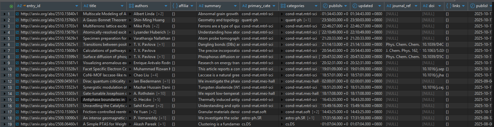

# arXiv Academic Data Pipeline

## 專案簡介

本專案旨在設計並實現一個高可用、可追蹤且具備容錯能力的自動化數據管道。
目的是定期蒐集、處理並儲存 [arXiv](https://arxiv.org/) 的論文元資料，為後續的數據分析、趨勢監控、機構排名及論文推薦系統提供穩定且結構化的資料。

## 功能

* **自動化資料蒐集**：定時觸發 AWS Lambda，從 arXiv API 獲取指定學術領域的最新論文元資料。
* **高效率資料儲存**：將蒐集到的原始資料以 `jsonl.gz` 格式壓縮後儲存於 AWS S3，有效節省儲存空間與傳輸成本。
* **彈性化參數設定**：所有關鍵參數（如回溯月份、單次處理筆數、目標文章數量等）皆透過存放於 S3 的 `config.yaml` 進行統一管理，易於調整與維護。
* **平行化資料處理**：採用多個 ETL Lambda 平行處理 S3 上的原始檔案，將其解析、清洗並結構化地寫入 PostgreSQL 資料庫。
* **資料去重**：在資料蒐集與處理階段進行批次去重，確保資料庫中每篇論文的唯一性。
* **系統監控**：整合 AWS CloudWatch 監控 Lambda 函數的執行狀況，並於 EC2 上部署 Prometheus 與 Grafana，以監控核心服務的系統資源（CPU、記憶體、I/O 等）。
* **自動化部署**：整合 GitHub Actions，當 `main` 分支有更新時，自動觸發 CI/CD 流程，打包並部署最新的程式碼至 AWS Lambda。

## 資料成果(部分)

最終欄位


| 欄位名稱 | 資料類型 | 說明 |
| -------- | -------- | -------- |
| entry_id     | TEXT     | 論文的唯一識別碼，來自 arXiv 的原始 ID，作為主鍵。 |
| title | TEXT | 論文的完整標題。 |
| authors | TEXT[] | 作者列表，以文字陣列形式儲存所有作者的姓名。 |
| affiliations | JSONB | 作者所屬的機構資訊，使用 JSONB 格式以彈性儲存。 |
| summary | TEXT | 論文的摘要內容。 |
| primary_category | TEXT | 論文的主要學術分類。 |
| categories | TEXT[] | 論文所有相關的學術分類列表。 |
| published | TIMESTAMPTZ | 論文首次發表的精確時間（含時區）。 |
| updated | TIMESTAMPTZ | 論文最後更新的精確時間（含時區）。 |
| journal_ref | TEXT | 若論文已發表於期刊，此為期刊參考資訊。 |
| doi | TEXT | 論文的數位物件識別碼 (Digital Object Identifier)。 |
| links | JSONB | 相關連結，例如 PDF 下載連結、專案主頁等，以 JSONB 格式儲存。 |
| published_date | DATE | 發表日期，方便按日期進行分組與查詢。 |
| updated_date | DATE | 更新日期，方便按日期進行分組與查詢。 |
| etl_timestamp | TIMESTAMPTZ | 該筆資料寫入資料庫的時間，用於追蹤資料處理時間。 |
| version | INT | 論文的版本號，例如 v1、v2。 |
| keywords | TEXT[] | 透過 NLP 技術從標題或摘要中提取的關鍵字陣列。 |
| topic | TEXT | 透過模型分析得出的更細分的主題領域。 |
| s3_path | TEXT | 該筆資料原始來源在 S3 上的路徑，用於資料追蹤與回溯。 |

## 系統架構

#### 雲端基礎設施
* **雲端平台**：AWS

#### 核心組件
* **資料蒐集**：AWS Lambda (Python) - 單一 Lambda 執行，避免因 IP 一致性觸發 API 速率限制。
* **資料處理**：AWS Lambda (Python) - 多個 Lambda 平行執行，提升處理效率。
* **資料儲存**：
    * AWS S3：儲存原始 `jsonl.gz` 格式的論文元資料。
    * Amazon EC2 + PostgreSQL 15：儲存結構化後的論文資料、作者資訊、機構資訊以及資料處理狀態。
* **系統監控**：
    * AWS CloudWatch：監控 Lambda 執行日誌、錯誤與效能指標。
    * Amazon EC2 + Prometheus & Grafana：監控 EC2 執行個體的系統資源使用率。

#### 資料流程
1.  **蒐集 (Collector Lambda)**：
    * 從 S3 讀取 `config.yaml` 設定。
    * 呼叫 arXiv API 抓取元資料。
    * 在記憶體中進行批次資料去重。
    * 將資料壓縮為 `jsonl.gz` 格式並上傳至 S3 Raw Data Bucket。
    * 將檔案的 S3 Key 與狀態記錄至 PostgreSQL。
2.  **處理 (ETL Lambda)**：
    * 從 S3 讀取 `config.yaml` 設定。
    * 查詢 PostgreSQL，獲取一批狀態為「待處理」的 `jsonl.gz` 檔案清單。
    * 從 S3 下載對應檔案。
    * 以串流方式讀取、解析資料，並轉換為符合資料庫結構的格式。
    * 批次將處理後的結構化資料寫入 PostgreSQL 的各個資料表中。
    * 更新 PostgreSQL 中對應檔案的狀態為「已完成」。
3.  **監控 (Monitoring)**：
    * CloudWatch 自動收集所有 Lambda 的執行紀錄。
    * Prometheus 定期抓取 EC2 的系統指標，由 Grafana 提供視覺化儀表板。

## 專案資料夾結構
```
.
├── README.md
├── build_lambda.sh
├── config
│   └── config.yaml
├── docs
│   └── result_picture.png
├── lambda_handlers
│   ├── collector
│   │   └── collector_handler.py
│   ├── etl
│   │   └── etl_handler.py
│   └── test
│       ├── test_pg_handler.py
│       └── test_s3_handler.py
├── pyproject.toml
├── src
│   ├── __init__.py
│   ├── __pycache__
│   ├── core
│   │   ├── __pycache__
│   │   ├── config.py
│   │   ├── db.py
│   │   └── pg_engine.py
│   ├── etl
│   │   └── arxiv_etl.py
│   ├── extract
│   │   └── arxiv_collector.py
│   ├── main.py
│   └── utils
│       └── initial
│           ├── create_bucket.py
│           ├── create_table.sql
│           └── initial.py
├── tests
│   └── test.ipynb
└── uv.lock
```

## 環境變數與設定

#### `config.yaml`
本專案的核心設定檔，控制管道的所有行為。需上傳至 S3，並在 Lambda 的環境變數中指定其路徑。主要參數包含：
* `source_papers.max_results_goal`: 每個學科領域預計抓取的最大文章數。
* `source_papers.lookback_months`: 資料回溯的月份。
* `source_papers.batch_size`: 每多少筆資料壓縮成一個 `.gz` 檔案。
* `lambda.num_categories_per_run`: Collector Lambda 單次執行時處理的學科數量。
* `etl.pending_gz_batch`: ETL Lambda 單次執行時處理的 `.gz` 檔案數量。

#### AWS Lambda 環境變數
為了安全性，所有敏感資訊（如資料庫連線資訊）皆應設定為 Lambda 的環境變數，而非寫在 `config.yaml` 中。
* `DB_HOST`: 資料庫主機位址
* `DB_PORT`: 資料庫連接埠
* `DB_USER`: 資料庫使用者名稱
* `DB_PASSWORD`: 資料庫密碼
* `DB_NAME`: 資料庫名稱
* `CONFIG_BUCKET`: 存放 `config.yaml` 的 S3 儲存桶名稱
* `CONFIG_KEY`: `config.yaml` 在 S3 儲存桶中的路徑

## 部署方式

本專案採用 CI/CD 自動化部署。
* **觸發條件**：當有新的程式碼被推送 (Push) 至 `main` 分支時。
* **執行流程**：GitHub Actions 會自動被觸發，執行 `build_lambda.sh` 腳本。
* **部署產物**：腳本會打包各個 Lambda 所需的原始碼與 Python 依賴套件，並將其部署更新至對應的 AWS Lambda 函數。


## 授權

本專案採用 [MIT License](https://opensource.org/licenses/MIT) 授權。

## 參考資料

[arXiv API Documentation](https://info.arxiv.org/help/api/index.html)

[AWS Lambda Developer Guide](https://docs.aws.amazon.com/lambda/latest/dg/welcome.html)

[Prometheus Documentation](https://prometheus.io/docs/introduction/overview/)

[Grafana Documentation](https://grafana.com/docs/)


## 開發過程遇到的問題
### 1. UnexpectedEmptyPageError
arvix 套件在抓取分頁時出現 UnexpectedEmptyPageError , 代表有空白頁面
但我實際把 pagesize 調整成跟 max_results 一樣大時, 就不會出現此問題
但為了防止有機會再次出現該問題, 我使用 offset 來控制被卡住的那一筆, 跳過後可讓後續正常執行
, 就不會因為一個 error 卡死整批資料。

### 2. Dynomodb 換成 PostgreSQL
原本架構會使用到 Dynomodb, 但因為我認為資料量龐大需頻繁寫入(尤其做去重檢核前, 需要大筆資料批次匯入, 自己嘗試過 Dynomodb 但批次最多 25 筆, 所以後來選用熟悉的 postgresql, 並支援大吞吐量, 也對未來有更多彈性)

### 3. AWS 各服務串聯
在 AWS 上 EC2、Lambda、S3 要串起來時因為子網域問題花了很多時間才解決

## TODO
因時間有限, 尚未完成但有想法的部分
1. 優化 run_lambda() 讓各 function 拆分成較細檔案架構, 使程式看起來更優美
2. 將各 log 打到 OpenSearch or ElasticSearch, 以便後續追蹤與分析
3. 新增 monitor lambda 讓過久的資料自行清除
4. Readme 的安裝此系統的流程